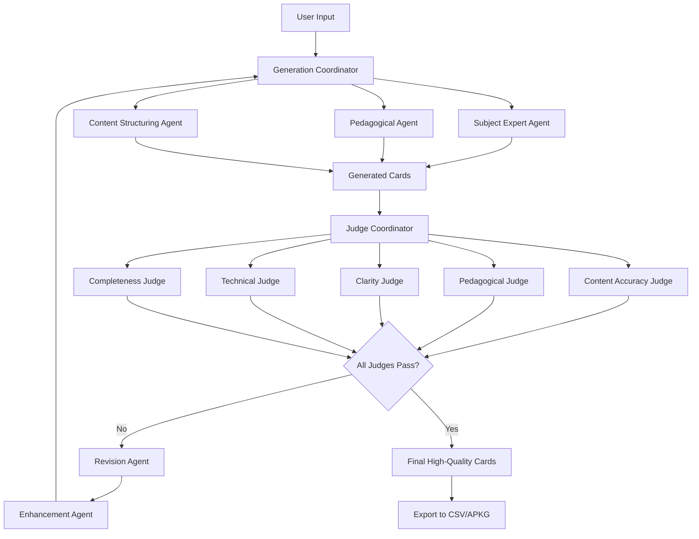

# AnkiGen - Anki Card Generator

AnkiGen is a Gradio-based web application that generates high-quality Anki-compatible CSV and `.apkg` deck files using an advanced multi-agent system powered by OpenAI Agents. The system employs specialized generator agents, quality assessment judges, and enhancement agents to create superior flashcards.

## Features

- **Multi-Agent Card Generation**: Utilizes specialized agents for subject expertise, pedagogical guidance, and content structuring
- **Quality Assurance System**: Multiple judge agents evaluate cards for accuracy, clarity, pedagogical value, and completeness
- **Adaptive Enhancement**: Revision and enhancement agents improve cards based on judge feedback
- Generate Anki cards for various subjects or from provided text/URLs
- Generate a structured learning path for a complex topic
- Customizable number of topics and cards per topic
- User-friendly interface powered by Gradio
- Exports to CSV for manual import or `.apkg` format with default styling
- Advanced OpenAI Agents SDK integration with structured outputs

## How It Works



## Installation for Local Use

Preferred usage: [uv](https://github.com/astral-sh/uv)

1.  Clone this repository:

    ```bash
    git clone https://github.com/brickfrog/ankigen.git
    cd ankigen
    uv venv
    source .venv/bin/activate # Activate the virtual environment
    ```

2.  Install the required dependencies:

    ```bash
    uv pip install -e . # Install the package in editable mode
    ```

3.  Set up your OpenAI API key:
    - Create a `.env` file in the project root (`ankigen/`).
    - Add your key like this: `OPENAI_API_KEY="your_sk-xxxxxxxx_key_here"`
    - The application will load this key automatically.
    - **Note**: This application requires OpenAI API access and uses the `openai-agents` SDK for advanced multi-agent functionality.

## Usage

1.  Ensure your virtual environment is active (`source .venv/bin/activate`).

2.  Run the application:

    ```bash
    uv run python app.py
    ```
    *(Note: The `gradio app.py` command might also work but using `python app.py` within the `uv run` context is recommended.)*

3.  Open your web browser and navigate to the provided local URL (typically `http://127.0.0.1:7860`).

4.  In the application interface:
    - Your API key should be loaded automatically if using a `.env` file, otherwise enter it.
    - Select the desired generation mode ("Single Subject", "Learning Path", "From Text", "From Web").
    - Fill in the relevant inputs for the chosen mode.
    - Adjust generation parameters (model, number of topics/cards, preferences).
    - Click "Generate Cards" or "Analyze Learning Path".

5.  Review the generated output.

6.  For card generation, click "Export to CSV" or "Export to Anki Deck (.apkg)" to download the results.

## Project Structure

The codebase uses a sophisticated multi-agent architecture powered by the OpenAI Agents SDK:

-   `app.py`: Main Gradio application interface and event handling.
-   `ankigen_core/`: Directory containing the core logic modules:
    -   `agents/`: **OpenAI Agents system implementation**:
        -   `base.py`: Base agent wrapper and configuration classes
        -   `generators.py`: Specialized generator agents (SubjectExpertAgent, PedagogicalAgent, ContentStructuringAgent)
        -   `judges.py`: Quality assessment agents (ContentAccuracyJudge, PedagogicalJudge, ClarityJudge, etc.)
        -   `enhancers.py`: Revision and enhancement agents for card improvement
        -   `integration.py`: AgentOrchestrator for coordinating the entire agent system
        -   `config.py`: Agent configuration management
        -   `schemas.py`: Pydantic schemas for structured agent outputs
        -   `templates/`: Jinja2 templates for agent prompts
    -   `models.py`: Pydantic models for data structures.
    -   `utils.py`: Logging, caching, web fetching utilities.
    -   `llm_interface.py`: OpenAI API client management.
    -   `card_generator.py`: Integration layer for agent-based card generation.
    -   `learning_path.py`: Logic for the learning path analysis feature.
    -   `exporters.py`: Functions for exporting data to CSV and `.apkg`.
    -   `ui_logic.py`: Functions handling UI component updates and visibility.
-   `tests/`: Contains unit and integration tests.
    -   `unit/`: Tests for individual modules in `ankigen_core`.
    -   `integration/`: Tests for interactions between modules and the app.
-   `pyproject.toml`: Defines project metadata, dependencies, and build system configuration.
-   `README.md`: This file.

## Agent System Architecture

AnkiGen employs a sophisticated multi-agent system built on the OpenAI Agents SDK that ensures high-quality flashcard generation through specialized roles and quality control:

### Generator Agents
- **SubjectExpertAgent**: Provides domain-specific expertise for accurate content creation
- **PedagogicalAgent**: Ensures cards follow effective learning principles and memory techniques
- **ContentStructuringAgent**: Optimizes card structure, formatting, and information hierarchy

### Quality Assurance Judges
- **ContentAccuracyJudge**: Verifies factual correctness and subject matter accuracy
- **PedagogicalJudge**: Evaluates learning effectiveness and educational value
- **ClarityJudge**: Assesses readability, comprehension, and clear communication
- **TechnicalJudge**: Reviews technical accuracy for specialized subjects
- **CompletenessJudge**: Ensures comprehensive coverage without information gaps

### Enhancement Agents
- **RevisionAgent**: Identifies areas for improvement based on judge feedback
- **EnhancementAgent**: Implements refinements and optimizations to failed cards

### Orchestration
- **GenerationCoordinator**: Manages the card generation workflow and agent handoffs
- **JudgeCoordinator**: Coordinates quality assessment across all judge agents
- **AgentOrchestrator**: Main system controller that initializes and manages the entire agent ecosystem

This architecture ensures that every generated flashcard undergoes rigorous quality control and iterative improvement, resulting in superior learning materials.

## Development

This project uses `uv` for environment and package management and `pytest` for testing.

1.  **Setup:** Follow the Installation steps above.

2.  **Install Development Dependencies:**
    ```bash
    uv pip install -e ".[dev]"
    ```

3.  **Running Tests:**
    - To run all tests:
      ```bash
      uv run pytest tests/
      ```
    - To run with coverage:
      ```bash
      uv run pytest --cov=ankigen_core tests/
      ```
    *(Current test coverage target is >= 80%. As of the last run, coverage was ~89%.)*

4.  **Code Style:** Please use `black` and `ruff` for formatting and linting (configured in `pyproject.toml` implicitly via dev dependencies, can be run manually).

5.  **Making Changes:**
    - Core logic changes should primarily be made within the `ankigen_core` modules.
    - UI layout and event wiring are in `app.py`.
    - Add or update tests in the `tests/` directory for any new or modified functionality.

## TODO

- [ ] Edit columns /fields
- [ ] Improve crawler / RAG integration with agents
- [ ] Add agent performance metrics and monitoring
- [ ] Implement agent conversation history and context persistence
- [ ] Add custom agent configuration UI
- [ ] Expand subject-specific agent templates

## License

BSD 2-Clause License

## Acknowledgments

- This project uses the Gradio library (https://gradio.app/) for the web interface.
- Card generation is powered by OpenAI's language models.
